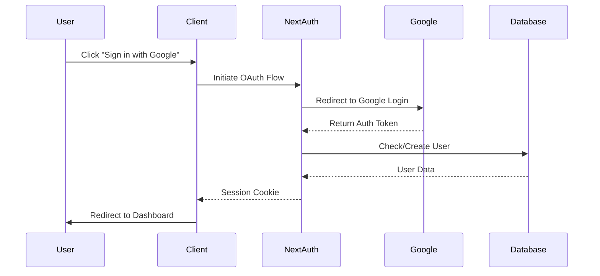
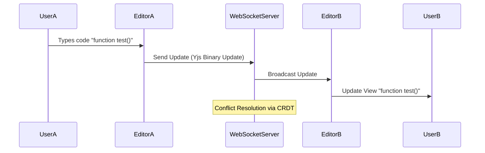
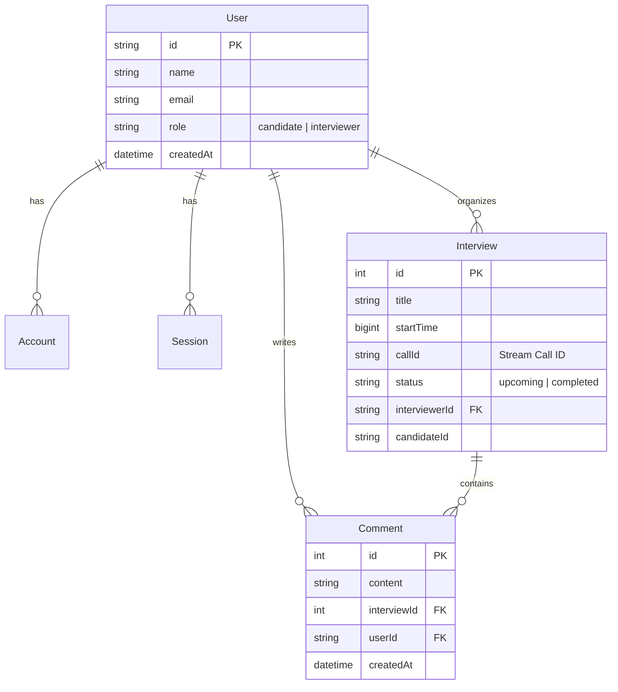

# SkillSync: Real-time Collaborative Technical Interview Platform
## Project Report

**Student Name:** Shubham
**Project Name:** SkillSync
**Date:** November 21, 2025

---

## 1. Executive Summary

SkillSync is a modern, full-stack web application designed to revolutionize the technical interview process. It addresses the fragmentation in current hiring workflows by integrating video conferencing, real-time collaborative code editing, and interview scheduling into a single, cohesive platform. Built with Next.js 14, TypeScript, and PostgreSQL, SkillSync offers a seamless experience for both interviewers and candidates, enabling efficient evaluation of technical skills in a realistic, collaborative environment.

---

## 2. Introduction

### 2.1 Problem Statement
Conducting technical interviews remotely is often a disjointed experience. Interviewers typically juggle multiple tools:
- A video conferencing tool (Zoom, Google Meet)
- A shared code editor (Google Docs, CoderPad)
- A scheduling tool (Calendly, Email)
- A separate system for recording feedback

This context switching leads to inefficiencies, poor user experience, and potential loss of critical evaluation data.

### 2.2 Proposed Solution
SkillSync unifies these essential components into one platform. It provides:
- **Integrated Video/Audio**: High-quality communication without leaving the browser.
- **Synchronized Code Editor**: A VS Code-like environment where both parties can type and see changes instantly.
- **Centralized Management**: Dashboard for scheduling, reviewing past interviews, and managing question banks.

---

## 3. Technology Stack & Justification

### 3.1 Frontend: Next.js 14 (App Router) & React
- **Why Next.js?** Next.js was chosen for its robust Server-Side Rendering (SSR) and Static Site Generation (SSG) capabilities, which ensure fast initial load times and better SEO. The new App Router (Next.js 14) simplifies routing and layout management, allowing for nested layouts and efficient data fetching directly in server components.
- **Why React?** React's component-based architecture promotes code reusability and maintainability. Its vast ecosystem and community support make it the industry standard for building dynamic user interfaces.
- **Why TypeScript?** TypeScript adds static typing to JavaScript, significantly reducing runtime errors and improving developer productivity through better IDE support (IntelliSense).

### 3.2 Backend: Next.js API Routes & Node.js
- **Why Serverless Functions?** Next.js API routes allow us to build backend endpoints within the same project structure. This reduces deployment complexity and allows for seamless type sharing between frontend and backend.
- **Why Node.js?** Node.js is efficient for handling I/O-heavy operations, which is crucial for a real-time application.

### 3.3 Database: PostgreSQL & Prisma ORM
- **Why PostgreSQL?** PostgreSQL is a powerful, open-source relational database known for its reliability, data integrity, and support for complex queries. It is ACID compliant, ensuring safe transaction processing for critical data like interview schedules and user records.
- **Why Prisma?** Prisma is a modern ORM that provides a type-safe database client. It simplifies database interactions with an intuitive API, manages schema migrations automatically, and prevents common SQL injection vulnerabilities.

### 3.4 Real-time Communication: Stream SDK & Yjs
- **Why Stream Video/Chat?** Building scalable video infrastructure from scratch is complex and resource-intensive. Stream provides a managed global infrastructure for low-latency video and chat, allowing us to focus on application logic rather than WebRTC maintenance.
- **Why Yjs?** Yjs is a high-performance CRDT (Conflict-free Replicated Data Type) library. It enables real-time collaborative editing by handling conflict resolution automatically, ensuring that all users see the same document state regardless of network latency or concurrent edits.

### 3.5 Styling: Tailwind CSS & shadcn/ui
- **Why Tailwind?** Utility-first CSS allows for rapid UI development without leaving the HTML. It ensures design consistency and reduces CSS bundle size.
- **Why shadcn/ui?** A collection of accessible, reusable components built on Radix UI primitives. It provides a polished, professional look out of the box while being fully customizable.

---

## 4. System Architecture

### 4.1 High-Level Architecture
The system follows a client-server architecture with a dedicated microservice for real-time collaboration.

1.  **Client Layer**: Next.js application running in the user's browser.
2.  **API Layer**: Next.js API routes handling authentication, data persistence, and third-party integrations.
3.  **Service Layer**:
    *   **Auth Service**: NextAuth.js handling Google OAuth.
    *   **Collaboration Service**: A separate Express.js server using WebSockets to sync Yjs document states.
    *   **Media Service**: Stream SDK handling video/audio routing and recording.
4.  **Data Layer**: PostgreSQL database storing user data, interview metadata, and comments.

### 4.2 Data Flow Diagrams

#### 4.2.1 Authentication Flow

#### 4.2.2 Real-time Code Collaboration Flow

---

## 5. Database Design

### 5.1 Entity Relationship (ER) Diagram

The database schema is designed to support users, interviews, and feedback.

### 5.2 Schema Explanation
- **User**: Stores profile information and role (Interviewer/Candidate).
- **Interview**: The core entity linking an interviewer to a time slot and a Stream call ID.
- **Comment**: Allows interviewers to leave feedback on specific interviews.
- **Account/Session**: Managed by NextAuth for handling OAuth tokens and session persistence.

---

## 6. Implementation Details

### 6.1 Key Features Implemented
1.  **Role-Based Dashboard**:
    *   Interviewers see controls to schedule meetings and manage questions.
    *   Candidates see a simplified view of their upcoming schedule.
2.  **Meeting Room**:
    *   Split-pane layout: Video on the left, Code Editor on the right.
    *   Toolbar for toggling mic/camera, screen sharing, and ending calls.
3.  **Coding Environment**:
    *   Language selector (JS, Python, Java, C++).
    *   "Run Code" simulation (syntax check).
    *   Question selector populating the editor with problem descriptions.

### 6.2 Challenges & Solutions
-   **Challenge**: Synchronizing code state across clients with low latency.
    *   **Solution**: Implemented Yjs with a custom WebSocket provider. This ensures that even if two users type simultaneously, the document merges correctly without data loss.
-   **Challenge**: Managing video call state and permissions.
    *   **Solution**: Leveraged Stream's React components and hooks (`useCall`, `useParticipantView`) to abstract away the complexity of WebRTC state management.
-   **Challenge**: Persisting complex interview data.
    *   **Solution**: Used Prisma with PostgreSQL to maintain relational integrity between users, interviews, and comments.

---

## 7. Future Scope

1.  **Code Execution Engine**: Integrate a sandbox environment (like Piston API) to actually execute the code written by candidates and show output.
2.  **AI-Powered Insights**: Use LLMs to analyze the interview transcript and code to generate an automated summary and score.
3.  **Whiteboard Integration**: Add a collaborative canvas for system design interviews.
4.  **Mobile Application**: Develop a React Native companion app for joining calls on the go.

---

## 8. Conclusion

SkillSync successfully demonstrates how modern web technologies can be composed to solve complex, real-time problems. By leveraging Next.js for structure, Prisma for data, and Stream/Yjs for real-time capabilities, the platform delivers a robust, production-grade experience for technical interviews. The project meets all functional requirements and provides a solid foundation for future enhancements.

---
